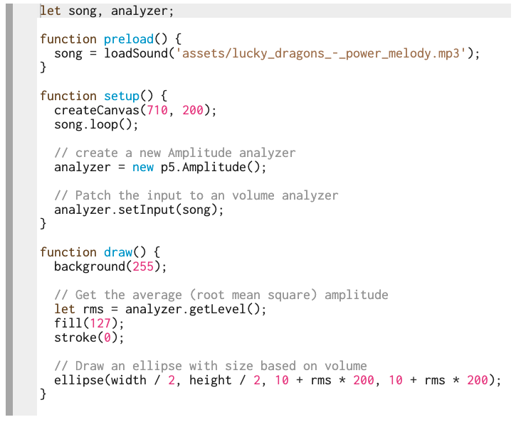
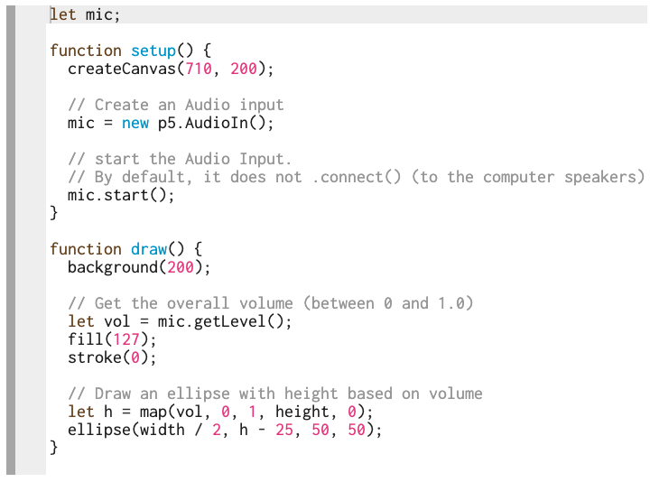
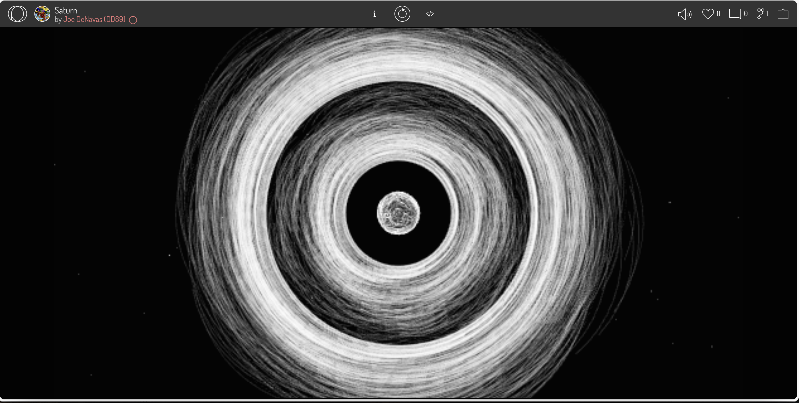
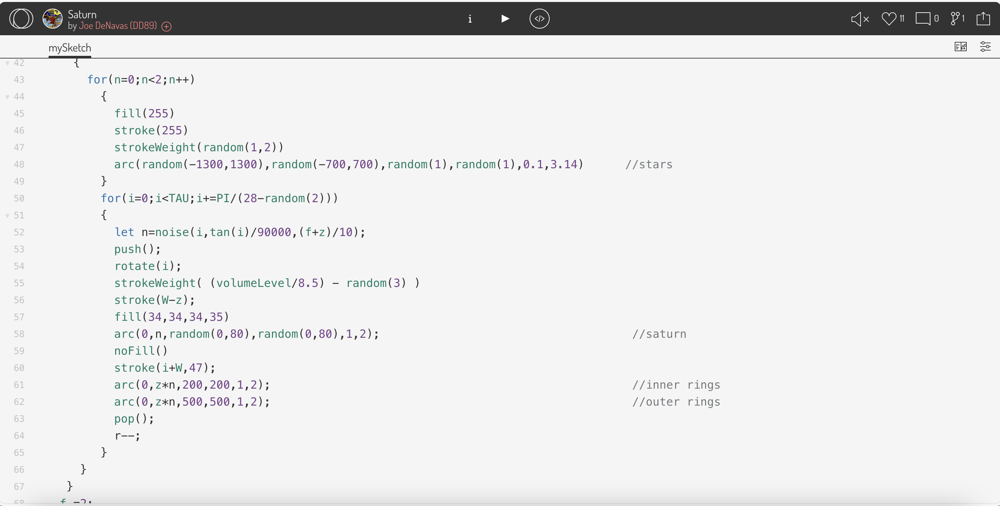

# ckon6574_9103_tut5
# Quiz 8
### Part 1: Imaging Technique Inspiration

The initial inspiration came simply from Apple’s Digital Assistant, Siri. When activated, Siri would appear in a circular shape, waiting for a prompt. When speaking to Siri, the circular shape pulsates, corresponding with the word spoken, instilling the circle's liveliness. This further inspired to the idea of manipulating generative art using an audio track or speech input. For example, in “Wheels or Fortune” by Pacita Abad, the circular shape and other parameters, such as colour or shape, could be manipulated with audio signal. This would create a unique interaction between the generative art version of the artwork and the user. 

### Part 2: Coding Technique Exploration

In the [sample](https://p5js.org/examples/sound-measuring-amplitude.html) code on p5.js website, with the additional sound libraries, the amplitude data or loudness of the audio signal can be analysed and extracted using _p5.Amplitude_ and _getLevel()_. In this sample, the variable _rms_ is used to manipulate the drawing parameters (width and height) of the ellipse.

In this [example](https://p5js.org/examples/sound-mic-input.html) the amplitude of the live audio input, obtained using _getLevel()_ and _p5.AudioIn()_, is used to determine the height (yPos) of the ellipse drawn. This showcases a basic interaction of using user own voice to manipulate the code.

In the last [example](https://openprocessing.org/sketch/2132175), Saturn by Joe DeNavas, the amplitude is used to manipulate the _strokeWeight()_ of the drawing.

